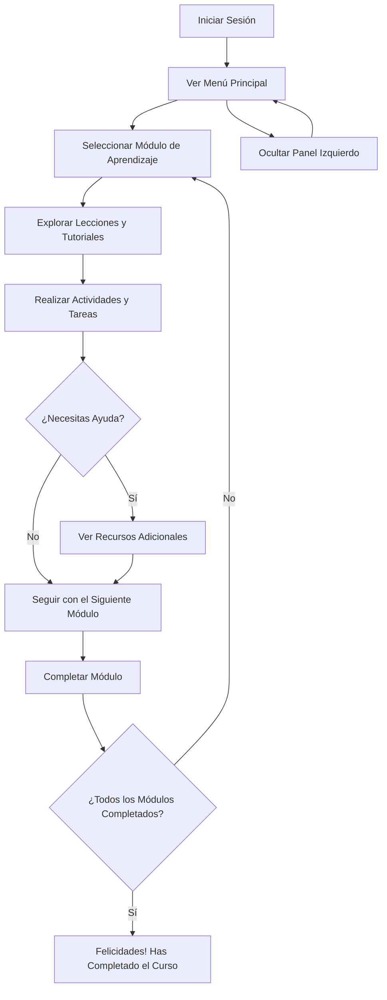

# Creación de páginas web y marketing

## Descripción general

Este programa educativo está diseñado para personas sin experiencia en programación que desean aprender a crear páginas web y desarrollar habilidades en marketing digital. La aplicación es multiplataforma y utiliza tecnologías modernas para proporcionar una experiencia de aprendizaje interactiva y eficiente.

## Características principales

1. Interfaz de usuario intuitiva
2. Lecciones interactivas sobre HTML, CSS y JavaScript
3. Módulos de marketing digital
4. Chat de asistencia con avatar personalizado
5. Compatibilidad multiplataforma

## Tecnologías utilizadas

- Electron.js: Framework para crear aplicaciones de escritorio multiplataforma
- HTML: Lenguaje de marcado para estructurar el contenido
- CSS: Lenguaje de estilos para el diseño visual
- JavaScript: Lenguaje de programación para la interactividad

## Uso del programa

### Navegación principal

El programa se divide en las siguientes secciones principales:

1. Introducción
2. HTML básico
3. CSS fundamentales
4. JavaScript para principiantes
5. Conceptos de marketing digital
6. Proyectos prácticos

Navega por estas secciones utilizando el menú lateral izquierdo.

### Lecciones interactivas

Cada lección incluye:

- Explicaciones teóricas
- Ejemplos prácticos
- Ejercicios interactivos
- Cuestionarios de autoevaluación

### Chat de asistencia

Para acceder al chat de asistencia:

1. Haz clic en el icono de chat en la esquina inferior derecha.
2. Escribe tu pregunta en el campo de texto.
3. Presiona "Enviar" o la tecla "Enter".

El avatar personalizado de DiceBear responderá a tus dudas de manera eficiente.

---

## Manejo de la Aplicación

### Navegación por la Aplicación

La aplicación está organizada en dos paneles principales que te ayudarán a moverte fácilmente entre las diferentes áreas y herramientas.

### Panel Izquierdo

- **Inicio**: Aquí encontrarás una introducción general a la aplicación y un resumen de sus funcionalidades.
- **Módulos de Aprendizaje**: Podrás acceder a los diferentes módulos sobre creación de sitios web y marketing digital.

### Panel Derecho

Este panel muestra el contenido y las herramientas relacionadas con el módulo o sección en la que te encuentres:

- **Lecciones y Tutoriales**: Siguiendo los pasos dentro de cada módulo, podrás realizar las tareas propuestas directamente desde aquí.
- **Recursos Adicionales**: Incluye videos, documentos y enlaces útiles para profundizar en los temas.

### Opción de Ver/Ocultar el Panel Izquierdo

En la esquina superior izquierda, encontrarás una flecha que te permite ocultar o mostrar el panel izquierdo, dándote más espacio para trabajar en el panel derecho.

### Visor Web

Nuestro visor web integrado te permitirá ver cómo se desarrolla tu sitio web en tiempo real mientras trabajas en él, facilitando la visualización de los cambios al instante.

---

## Módulos

- Módulo #2: 
- Módulo #3: 
- Módulo #4: 
- Módulo #5: 
- Módulo #6: 
- Módulo #7: 
- Módulo #8: 
- Módulo #9: 
- Módulo #10: 
- Módulo #11: 
- Módulo #12: 
- Módulo #13: 
- Módulo #14: 
- Módulo #15: 
- Módulo #16: 
- Módulo #17: 
- Módulo #18: 
- Módulo #19: 
- Módulo #20:

---

## Diagrma de flujo

